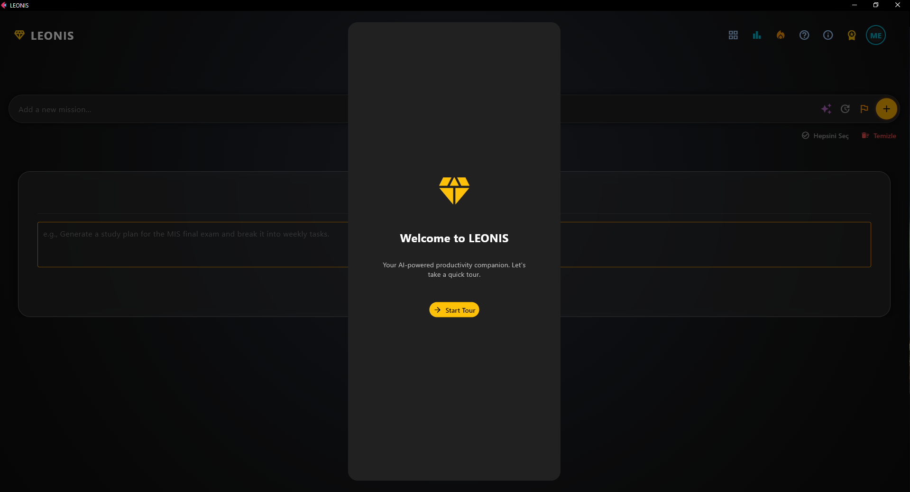
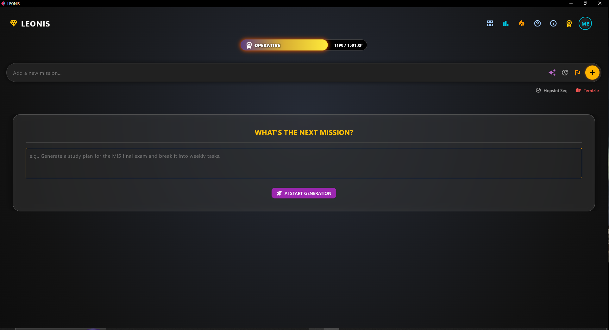

# LEONIS
## *Level Up Your Life, One Task at a Time.*

Leonis is a futuristic, gamified, and AI-powered task management application designed to transform your daily productivity into an engaging RPG-like experience. Built with Python and Flet, it merges the utility of a robust To-Do list with the satisfying progression systems of modern gaming.

<p align="center">
  
  &nbsp; &nbsp; 
</p>

---

## 🌌 The Antigravity Experience

> **Built with Google Antigravity**

This project stands as a testament to the future of software engineering: **Agentic Development**. Leonis was not just "coded"; it was architected through a symbiotic workflow between a human developer and **Google Antigravity**, an advanced AI-powered IDE.

In this paradigm, the developer acts as the visionary architect, while the Antigravity agents handle the heavy lifting of complex logic generation, real-time refactoring, and error resolution. This "Vibe Coding" approach allows for rapid iteration and a focus on high-level design and user experience, leaving the implementation details to the intelligent agents.

---

## ⚡ Key Features

### 🕵️‍♂️ AI Detective Mode
Stuck on a broad goal? Leonis integrates **Google Gemini AI** to act as your personal productivity detective. Simply type a vague task like "Learn Python," and the AI will break it down into 3-5 actionable, bite-sized sub-steps automatically.

### 🎮 RPG Gamification
Turn chores into quests.
* **XP System**: Earn Experience Points for every completed task.
* **Rank Progression**: Climb the ladder from a lowly *Neophyte* to a legendary *Grandmaster*.
* **Visual Rewards**: Enjoy satisfying Lottie animations and confetti effects upon task completion.

### 📊 Advanced Analytics
Visualize your productivity journey.
* **Heatmap**: A GitHub-style contribution graph tracking your consistency over the last 6 months.
* **Weekly Charts**: Detailed bar charts showcasing your daily performance.
* **Streak Counter**: Keep the flame alive with a daily login streak system.

### 🧘 Focus Mode
Enter the flow state with a built-in **Pomodoro Timer**. Features a "Hyper-Focus" visualizer and adjustable session lengths to keep you locked in on the task at hand.

---

## 🛠️ Tech Stack

* **Language**: Python 3.x
* **Framework**: [Flet](https://flet.dev) (Flutter for Python)
* **AI Engine**: Google Gemini API (`google-generativeai`)
* **Security**: `python-dotenv` for environment variable management
* **Development Platform**: Google Antigravity

---

## 📦 Installation

1.  **Clone the Repository**
    ```bash
    git clone [https://github.com/yourusername/leonis.git](https://github.com/yourusername/leonis.git)
    cd leonis
    ```

2.  **Install Dependencies**
    ```bash
    pip install flet google-generativeai python-dotenv
    ```

3.  **Configure API Key (Security Step)**
    * Get your free API Key from [Google AI Studio](https://aistudio.google.com/).
    * Create a new file named `.env` in the root directory of the project.
    * Add the following line to the file (replace with your actual key):
    ```text
    GOOGLE_API_KEY=your_actual_api_key_here
    ```

4.  **Run the App**
    ```bash
    flet run main.py
    ```

---
*Developed by Mustafa Bera Ekmekçi via Google Antigravity.*